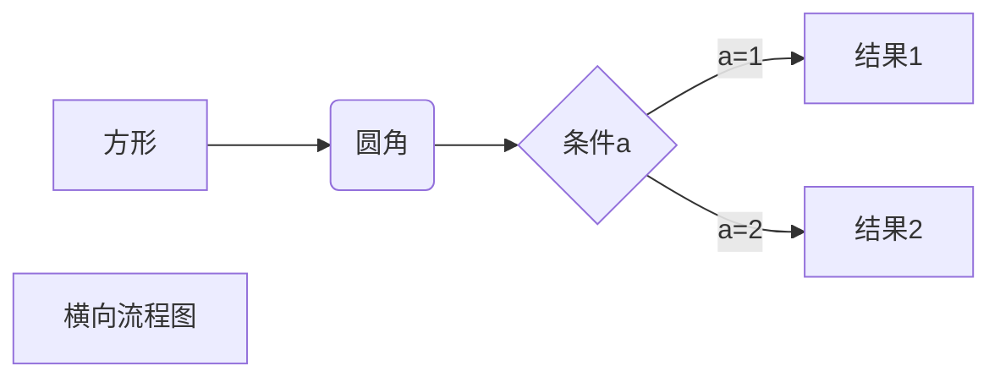

# Markdown 教程

markdown文件可由typora、vscode等编辑器编辑

一级标题用一个#号

```markdown
# Hello World! 
```

# Markdown 标题

# Markdown 段落

## 字体

```markdown
*斜体文本*
_斜体文本_
**粗体文本**
__粗体文本__
***粗斜体文本***
___粗斜体文本___
```

## 分隔线

你可以在一行中用三个以上的星号、减号、底线来建立一个分隔线，行内不能有其他东西。你也可以在星号或是减号中间插入空格。下面每种写法都可以建立分隔线：

```markdown
***

* * *

*****

- - -

----------
```

## 删除线

如果段落上的文字要添加删除线，只需要在文字的两端加上两个波浪线 **~~** 即可，实例如下：

```markdown
RUNOOB.COM
GOOGLE.COM
~~BAIDU.COM~~
```

## 下划线

下划线可以通过 HTML 的 **<u>** 标签来实现：

```markdown
<u>带下划线文本</u>
```

<u>pengborui</u>

## 脚注

脚注是对文本的补充说明,是可以附在文章页面的最底端的，对某些东西加以说明，印在书页下端的注文。脚注和尾注是对文本的补充说明。脚注一般位于页面的底部，可以作为文档某处内容的注释；尾注一般位于文档的末尾，列出引文的出处等。

Markdown 脚注的格式如下:

```markdown
[^要注明的文本]
```

[^这是一个脚注]: 哈哈哈

举例[^这是一个脚注]

# Markdown 列表

Markdown 支持有序列表和无序列表。

无序列表使用星号(*****)、加号(**+**)或是减号(**-**)作为列表标记，这些标记后面要添加一个空格，然后再填写内容：

```markdown
* 第一项
* 第二项
* 第三项

+ 第一项
+ 第二项
+ 第三项


- 第一项
- 第二项
- 第三项
```

+ 可乐
+ 咖啡
+ 啤酒

有序列表使用数字并加上 **.** 号来表示，如：

```markdown
1. 第一项
2. 第二项
3. 第三项
```

1. 起床

2. 刷牙
3. 洗脸

### 列表嵌套

列表嵌套只需在子列表中的选项前面添加四个空格即可：

1.  一年级生
   - 张三
   - 李四

2. 二年级生
   - 王五
   - 赵六

# Markdown 区块

Markdown 区块引用是在段落开头使用 **>** 符号 ，然后后面紧跟一个**空格**符号：

```markdown
> 区块引用
> 菜鸟教程
> 学的不仅是技术更是梦想
```

另外区块是可以嵌套的，一个 **>** 符号是最外层，两个 **>** 符号是第一层嵌套，以此类推：

```markdown
> 最外层
> > 第一层嵌套
> > > 第二层嵌套
```

### 区块中使用列表

区块中使用列表实例如下：

```markdown
> 区块中使用列表
> 1. 第一项
> 2. 第二项
> + 第一项
> + 第二项
> + 第三项
```

### 列表中使用区块

如果要在列表项目内放进区块，那么就需要在 **>** 前添加四个空格的缩进。

列表中使用区块实例如下：

```markdown
* 第一项
    > 菜鸟教程
    > 学的不仅是技术更是梦想
* 第二项
```

> 这是一个区块
>
> > 这是一个子区块
> >
> > > 这是最里层的区块

# Markdown 代码

如果是段落上的一个函数或片段的代码可以用反引号把它包起来（**`**），例如：

```markdown
`printf()` 函数
```

```javascript
document.write('hello world!')
```

你可以用 **```** 包裹一段代码，并指定一种语言（也可以不指定）：

~~~javascript
```javascript
$(document).ready(function () {
    alert('RUNOOB');
});
```
~~~

# Markdown 链接

链接使用方法如下：

```markdown
[链接名称](链接地址)

或者

<链接地址>
```

例如：

```markdown
这是一个链接 [菜鸟教程](https://www.runoob.com)
```

[百度](https://www.baidu.com)

# Markdown 图片

Markdown 图片语法格式如下：

```markdown


```

- 开头一个感叹号 !
- 接着一个方括号，里面放上图片的替代文字
- 接着一个普通括号，里面放上图片的网址，最后还可以用引号包住并加上选择性的 'title' 属性的文字。

使用实例：

```markdown


```


# Markdown 表格

Markdown 制作表格使用 **|** 来分隔不同的单元格，使用 **-** 来分隔表头和其他行。

语法格式如下：

```markdown
|  表头   | 表头  |
|  ----  | ----  |
| 单元格  | 单元格 |
| 单元格  | 单元格 |
```

**我们可以设置表格的对齐方式：**

- **-:** 设置内容和标题栏居右对齐。
- **:-** 设置内容和标题栏居左对齐。
- **:-:** 设置内容和标题栏居中对齐。

实例如下：

```markdown
| 左对齐 | 右对齐 | 居中对齐 |
| :-----| ----: | :----: |
| 单元格 | 单元格 | 单元格 |
| 单元格 | 单元格 | 单元格 |
```

| 数学 | 英语 | 物理 |
| :--: | :--: | :--: |
|  85  |  93  |  87  |

# Markdown 高级技巧

### 转义

Markdown 使用了很多特殊符号来表示特定的意义，如果需要显示特定的符号则需要使用转义字符，Markdown 使用反斜杠转义特殊字符：

```markdown
**文本加粗** 
\*\* 正常显示星号 \*\*
```

### 支持的 HTML 元素

不在 Markdown 涵盖范围之内的标签，都可以直接在文档里面用 HTML 撰写。

目前支持的 HTML 元素有：`<kbd> <b> <i> <em> <sup> <sub> <br>`等 ，如：

```markdown
使用 <kbd>Ctrl</kbd>+<kbd>Alt</kbd>+<kbd>Del</kbd> 重启电脑
```

使用<kbd>ctrl</kbd>+<kbd>alt</kbd>+<kbd>del</kbd>重启电脑

### 公式

**使用latex工具来编写公式**

当你需要在编辑器中插入数学公式时，可以使用两个美元符 $$ 包裹 TeX 或 LaTeX 格式的数学公式来实现。提交后，问答和文章页会根据需要加载 Mathjax 对数学公式进行渲染。如：

```latex
$$
\mathbf{V}_1 \times \mathbf{V}_2 =  \begin{vmatrix} 
\mathbf{i} & \mathbf{j} & \mathbf{k} \\
\frac{\partial X}{\partial u} &  \frac{\partial Y}{\partial u} & 0 \\
\frac{\partial X}{\partial v} &  \frac{\partial Y}{\partial v} & 0 \\
\end{vmatrix}
${$tep1}{\style{visibility:hidden}{(x+1)(x+1)}}
$$
```

$$
e=mc^2
$$

### typora 画流程图、时序图(顺序图)、甘特图

**使用mermaid工具来画流程图**

横向流程图举例：




